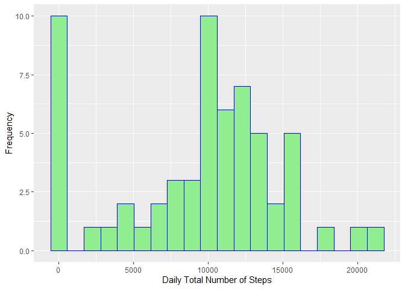
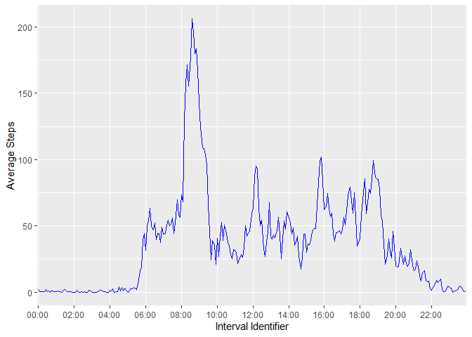
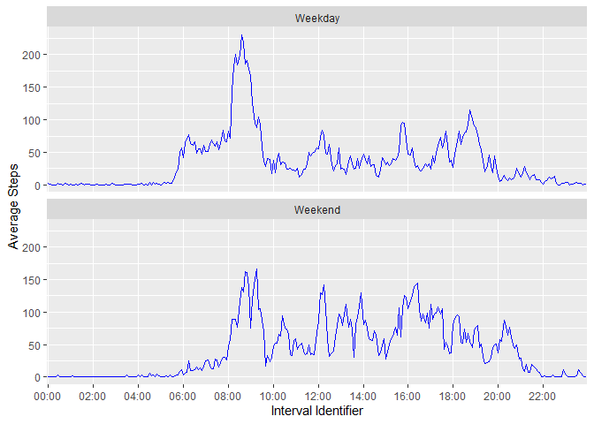

## Loading and preprocessing the data


```r
ActivityData = read.csv("activity.csv")
# A call to preview the structure of the data
str(ActivityData)
```

```
## 'data.frame':	17568 obs. of  3 variables:
##  $ steps   : int  NA NA NA NA NA NA NA NA NA NA ...
##  $ date    : Factor w/ 61 levels "2012-10-01","2012-10-02",..: 1 1 1 1 1 1 1 1 1 1 ...
##  $ interval: int  0 5 10 15 20 25 30 35 40 45 ...
```


```r
head(ActivityData)
```

```
##   steps       date interval
## 1    NA 2012-10-01        0
## 2    NA 2012-10-01        5
## 3    NA 2012-10-01       10
## 4    NA 2012-10-01       15
## 5    NA 2012-10-01       20
## 6    NA 2012-10-01       25
```


The following code chunk is wriiten so as to format the variable *interval* to appear as a time measure (e.g, 105 should appear as 1:05). Parsing *interval* as a time value using package *lubridate* would have been the easy thing to do; however, the raw format of the *interval* values does not fit into the orders recognized by *lubridate*. Hence, the formatting had to be done by programatically inserting ':' at the appropriate position in the string and padding with zeros where neccessary. Once in the desired format, variable *interval* is made a factor, so the dataframe can be grouped by *interval*.


```r
ActivityData$interval = sapply(ActivityData$interval, function(x) 
  if (nchar(as.character(x))==1){
  paste0('00:0',x)
  }
  else{
    if (nchar(as.character(x))==2){
  paste0('00:',x)
    }
    else{
      if (nchar(as.character(x))==3){
     gsub('^(.{1})(.+)$', '0\\1:\\2', x) 
      }
      else{
     gsub('^(.{2})(.+)$', '\\1:\\2', x) 
      }
    }
  }
)
ActivityData$interval = as.factor(ActivityData$interval)
# A call to preview the structure of the processed data
str(ActivityData)
```

```
## 'data.frame':	17568 obs. of  3 variables:
##  $ steps   : int  NA NA NA NA NA NA NA NA NA NA ...
##  $ date    : Factor w/ 61 levels "2012-10-01","2012-10-02",..: 1 1 1 1 1 1 1 1 1 1 ...
##  $ interval: Factor w/ 288 levels "00:00","00:05",..: 1 2 3 4 5 6 7 8 9 10 ...
```


```r
head(ActivityData)
```

```
##   steps       date interval
## 1    NA 2012-10-01    00:00
## 2    NA 2012-10-01    00:05
## 3    NA 2012-10-01    00:10
## 4    NA 2012-10-01    00:15
## 5    NA 2012-10-01    00:20
## 6    NA 2012-10-01    00:25
```


## What is mean total number of steps taken per day?


```r
library(dplyr)
```

```
## 
## Attaching package: 'dplyr'
```

```
## The following objects are masked from 'package:stats':
## 
##     filter, lag
```

```
## The following objects are masked from 'package:base':
## 
##     intersect, setdiff, setequal, union
```

```r
TotalStepsPerDay = ActivityData %>% group_by(date) %>% summarise(TotalSteps =sum(steps, na.rm = TRUE))
head(TotalStepsPerDay)
```

```
## # A tibble: 6 x 2
##   date       TotalSteps
##   <fct>           <int>
## 1 2012-10-01          0
## 2 2012-10-02        126
## 3 2012-10-03      11352
## 4 2012-10-04      12116
## 5 2012-10-05      13294
## 6 2012-10-06      15420
```


```r
library(ggplot2)
ggplot(TotalStepsPerDay, aes(x= TotalSteps))+
    geom_histogram(bins = 20,color = "blue", fill = "lightgreen")+
    labs(x = "Daily Total Number of Steps", y = "Frequency")
```

<!-- -->


```r
MeanDailyStep = mean(TotalStepsPerDay$TotalSteps)
MeanDailyStep
```

```
## [1] 9354.23
```

The mean total number of steps taken per day is **9354**.


```r
MedianDailyStep = median(TotalStepsPerDay$TotalSteps)
MedianDailyStep
```

```
## [1] 10395
```

The median total number of steps taken per day is **10395**.


## What is the average daily activity pattern?


```r
AverageStepsPerInterval = ActivityData %>% group_by(interval) %>% summarise(AverageSteps =mean(steps, na.rm = TRUE))
head(AverageStepsPerInterval)
```

```
## # A tibble: 6 x 2
##   interval AverageSteps
##   <fct>           <dbl>
## 1 00:00          1.72  
## 2 00:05          0.340 
## 3 00:10          0.132 
## 4 00:15          0.151 
## 5 00:20          0.0755
## 6 00:25          2.09
```


```r
ggplot(data = AverageStepsPerInterval, aes(x = interval, y = AverageSteps))+
  labs(x = "Interval Identifier", y = "Average Steps")+
  scale_x_discrete(breaks = AverageStepsPerInterval$interval[seq(from = 1, to = 288,by = 24)])+
  geom_line(colour = "blue", aes(group = 12))
```

<!-- -->


```r
MaximumStepInterval = AverageStepsPerInterval$interval[AverageStepsPerInterval$AverageSteps==max(AverageStepsPerInterval$AverageSteps)]
MaximumStepInterval
```

```
## [1] 08:35
## 288 Levels: 00:00 00:05 00:10 00:15 00:20 00:25 00:30 00:35 00:40 ... 23:55
```

The 5-minute interval that contains the maximum number of steps, on average across all the days, is **08:35**.

## Imputing missing values


```r
NumberofMissingValues = sum(is.na(ActivityData$steps))
NumberofMissingValues
```

```
## [1] 2304
```

The total number of missing values in the dataset is **2304**.

The following code chunk implements a simple scheme to create a new dataset wherein each missing value in the original dataset is replaced with mean number of steps for the correspondig 5-minute interval.


```r
ActivityData_new = ActivityData
ActivityData_new$steps[is.na(ActivityData_new$steps)] = unlist(sapply(ActivityData_new$interval[is.na(ActivityData_new$steps)], function(a,b)  ceiling(b[b$interval==a,2]), AverageStepsPerInterval))
head(ActivityData_new)
```

```
##   steps       date interval
## 1     2 2012-10-01    00:00
## 2     1 2012-10-01    00:05
## 3     1 2012-10-01    00:10
## 4     1 2012-10-01    00:15
## 5     1 2012-10-01    00:20
## 6     3 2012-10-01    00:25
```


```r
library(dplyr)
TotalStepsPerDay_new = ActivityData_new %>% group_by(date) %>% summarise(TotalSteps =sum(steps, na.rm = TRUE))
head(TotalStepsPerDay_new)
```

```
## # A tibble: 6 x 2
##   date       TotalSteps
##   <fct>           <dbl>
## 1 2012-10-01      10909
## 2 2012-10-02        126
## 3 2012-10-03      11352
## 4 2012-10-04      12116
## 5 2012-10-05      13294
## 6 2012-10-06      15420
```


```r
library(ggplot2)
ggplot(TotalStepsPerDay_new, aes(x= TotalSteps))+
    geom_histogram(bins = 20,color = "blue", fill = "lightgreen")+
    labs(x = "Daily Total Number of Steps", y = "Frequency")
```

-1.png)<!-- -->


```r
MeanDailyStep_new = mean(TotalStepsPerDay_new$TotalSteps)
MeanDailyStep_new
```

```
## [1] 10784.92
```

For the new dataset, the mean total number of steps taken per day is **1.0785\times 10^{4}**.


```r
MedianDailyStep_new = median(TotalStepsPerDay_new$TotalSteps)
MedianDailyStep_new
```

```
## [1] 10909
```

For the new dataset, the median total number of steps taken per day is **1.0909\times 10^{4}**.

Consequent upon updating the dataset by filling in the missing values, the estimated values of mean and median daily total steps for the updated dataset differs from those obtained from the original dataset. However, the impact of the updating is more significant on the mean (difference of **1431**) than it is on the median (difference of **514**).


## Are there differences in activity patterns between weekdays and weekends?


```r
library(dplyr)
ActivityData_new = ActivityData_new %>% mutate(DayStatus = factor((weekdays(as.POSIXct(date)) %in% c('Monday', 'Tuesday', 'Wednesday', 'Thursday', 'Friday')),levels=c(TRUE, FALSE), labels=c('Weekday', 'Weekend')))
head(ActivityData_new)
```

```
##   steps       date interval DayStatus
## 1     2 2012-10-01    00:00   Weekday
## 2     1 2012-10-01    00:05   Weekday
## 3     1 2012-10-01    00:10   Weekday
## 4     1 2012-10-01    00:15   Weekday
## 5     1 2012-10-01    00:20   Weekday
## 6     3 2012-10-01    00:25   Weekday
```


```r
AverageStepsPerInterval_status = ActivityData_new %>% group_by(DayStatus, interval) %>% summarise(AverageSteps =mean(steps))
head(AverageStepsPerInterval_status)
```

```
## # A tibble: 6 x 3
## # Groups:   DayStatus [1]
##   DayStatus interval AverageSteps
##   <fct>     <fct>           <dbl>
## 1 Weekday   00:00           2.29 
## 2 Weekday   00:05           0.533
## 3 Weekday   00:10           0.289
## 4 Weekday   00:15           0.311
## 5 Weekday   00:20           0.222
## 6 Weekday   00:25           1.71
```

```r
tail(AverageStepsPerInterval_status)
```

```
## # A tibble: 6 x 3
## # Groups:   DayStatus [1]
##   DayStatus interval AverageSteps
##   <fct>     <fct>           <dbl>
## 1 Weekend   23:30           1.44 
## 2 Weekend   23:35          11.6  
## 3 Weekend   23:40           6.38 
## 4 Weekend   23:45           1.75 
## 5 Weekend   23:50           0.125
## 6 Weekend   23:55           0.25
```


```r
ggplot(data = AverageStepsPerInterval_status, aes(x = interval, y = AverageSteps))+
  labs(x = "Interval Identifier", y = "Average Steps")+
  scale_x_discrete(breaks = AverageStepsPerInterval_status$interval[seq(from = 1, to = 288,by = 24)])+
  geom_line(colour = "blue", aes(group = DayStatus))+
  facet_wrap(~ DayStatus, nrow = 2)
```

<!-- -->


